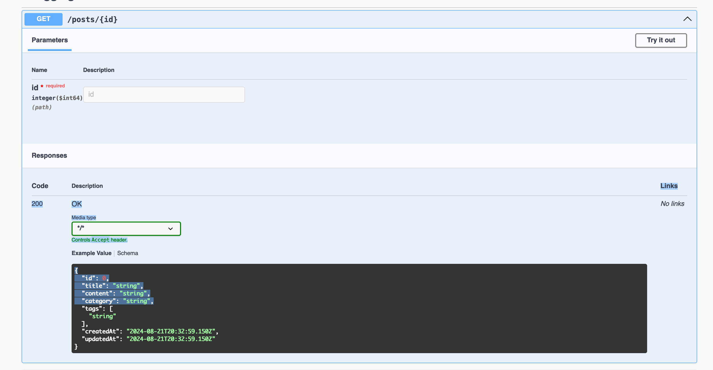
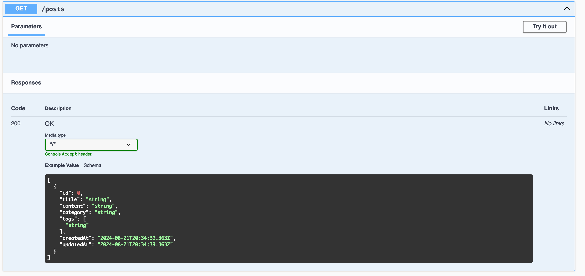
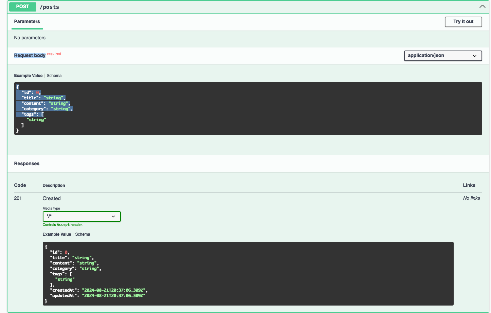
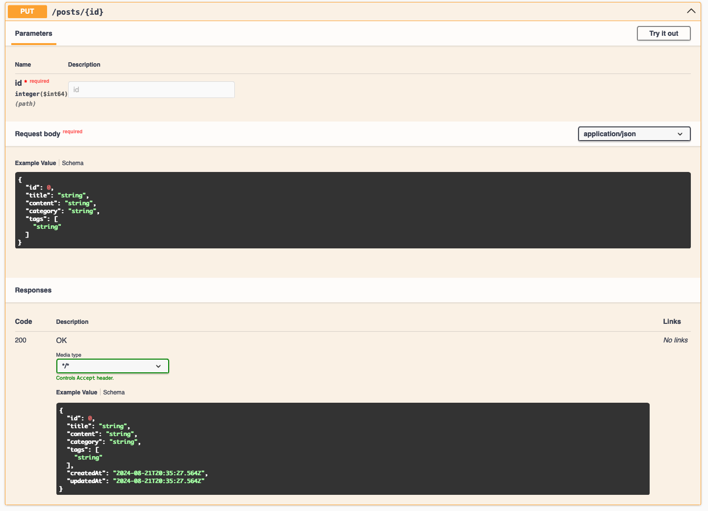
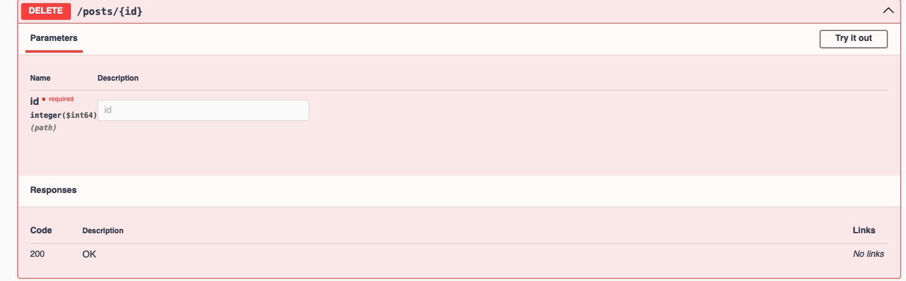

# blogging-platform-api

cc: [source-challenge](https://roadmap.sh/projects/blogging-platform-api)
## Requirements

For building and running the application you need:

- [JDK 1.8](http://www.oracle.com/technetwork/java/javase/downloads/jdk8-downloads-2133151.html)
- [Maven 3](https://maven.apache.org)

## Running the application locally

There are several ways to run a Spring Boot application on your local machine. One way is to execute the `main` method in the `BloggingPlatformApiApplication` class from your IDE.

Alternatively you can use the [Spring Boot Maven plugin](https://docs.spring.io/spring-boot/docs/current/reference/html/build-tool-plugins-maven-plugin.html) like so:

```shell
mvn spring-boot:run
```


### Swagger UI - [http://localhost:8080/swagger-ui.html](http://localhost:8080/swagger-ui.html)

### API Documentation - [http://localhost:8080/api-docs](http://localhost:8080/api-docs)

## Description

### GET /posts/{id} - returns a single post by id


### GET /posts - returns a list of posts



### POST /posts - creates a new post


### PUT /posts/{id} - updates a post


### DELETE /posts/{id} - deletes a post

